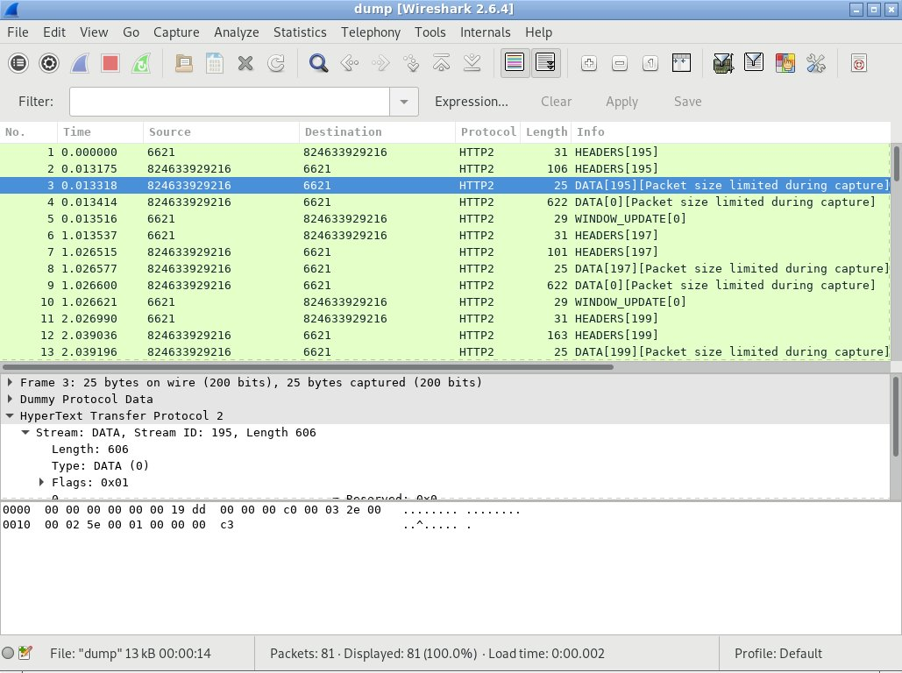

# gotlsdump

Dump TLS payload for go applications.

This tool uses bpf and uprobe to attach to two go functions:

- crypto/tls.(*Conn).Read
- crypto/tls.(*Conn).Write

And dump the data contents passed to or returned from these functions.

The `uretprobe` does not work with go applications, and using
`uretprobe` could crash the application.  This is because go moves
stacks around.  To safely catch return values of the tls `Read`
function, we first disassemble the function, then attach `uprobe` to
all `ret` instructions.

## Requirement

- bcc
- python elftools
- python distorm3

## Example

### build and run test go app

```
$ cd test && go build . && ./test https://example.com
```

### run the dump in another terminal

```
$ sudo ./gotlsdump.py --prog test/test --format pcap --output dump
^C
81 packets captured
```

### view the traffic with wireshark

```
$ wireshark-gtk -X lua_script:wireshark/dummy.lua dump
```

